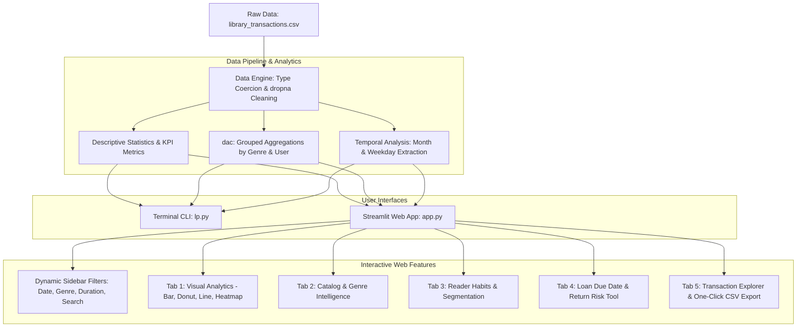

# 📚 Library Transactions Dashboard & Intelligence Hub

<div align="center">

[](https://lab-project-cjlukjwq2hxbxkt9akw8i3.streamlit.app/)


**A full-stack, data-driven Library Analytics & Management Intelligence Web Application built with Python, Streamlit, Plotly, Pandas, Matplotlib, and Seaborn.**

[🚀 Open Live Web App](https://lab-project-cjlukjwq2hxbxkt9akw8i3.streamlit.app/) • [📹 Watch Video Explanation](https://drive.google.com/file/d/1hKEeQ1wCzMTsTrJkVx93Nhko2SuTnXPy/view?usp=sharing) • [📂 GitHub Repository](https://github.com/krishpatel2985/lab-project)

</div>

---

> ### 🌐 Live Application URL
> Access the deployed, interactive web application instantly in your browser:  
> 👉 **[https://lab-project-cjlukjwq2hxbxkt9akw8i3.streamlit.app/](https://lab-project-cjlukjwq2hxbxkt9akw8i3.streamlit.app/)**
>
> 📹 **Video Demo & Explanation**: [Watch on Google Drive](https://drive.google.com/file/d/1hKEeQ1wCzMTsTrJkVx93Nhko2SuTnXPy/view?usp=sharing)

---

## 📑 Table of Contents

- [🌟 Overview](#-overview)
- [🏗️ System Architecture](#️-system-architecture)
- [✨ Key Features & Capabilities](#-key-features--capabilities)
- [📂 Project Structure](#-project-structure)
- [📊 Dataset Schema](#-dataset-schema)
- [🛠️ Installation & Local Setup](#️-installation--local-setup)
- [🚀 How to Run](#-how-to-run)
- [🔍 Complete Code Walkthrough (lp.py)](#-complete-code-walkthrough-lppy)
- [☁️ Streamlit Community Cloud Deployment](#️-streamlit-community-cloud-deployment)
- [👤 Author & Acknowledgments](#-author--acknowledgments)

---

## 🌟 Overview

The **Library Transactions Dashboard & Intelligence Hub** is an end-to-end data analysis and operational intelligence platform designed for library administration, readers, and data analysts. 

Originating from a core Python analysis pipeline (`lp.py`), it processes circulation records (`library_transactions.csv`), enforces rigorous data cleaning and type validation, performs multi-dimensional aggregations, and provides both:
1. **An Interactive, Production-Ready Streamlit Web App (`app.py`)** with dynamic real-time filtering, glassmorphic metric cards, Plotly interactive graphics, loan due-date forecasting, and dataset export tools.
2. **A Standalone Python Terminal & Visualization Script (`lp.py`)** producing static Matplotlib and Seaborn charts along with executive terminal reports.

---

## 🏗️ System Architecture



---

## ✨ Key Features & Capabilities

### 1. 🎛️ Dynamic Sidebar Filtering Controls
- **📅 Date Range Picker**: Real-time filtering across the transaction timeline with automatic start/end date validation.
- **🏷️ Genre Multi-Select**: Filter checkouts by single or multiple book categories with quick **"Select All"** and **"Clear All"** actions.
- **⏳ Borrow Duration Slider**: Segment transactions by loan period (from 1 to 60 days).
- **🔎 Universal Keyword Search**: Instant live querying by Book Title, Member ID (`U10xx`), or Genre.
- **📁 Custom Dataset Uploader**: Toggle between the bundled library dataset or upload your own CSV file on the fly.

### 2. ⚡ Executive Metric KPI Banners
- **Total Loans**: Total active checkout records analyzed.
- **Active Readers**: Count of unique library members in circulation.
- **Book Titles**: Catalog breadth and available titles.
- **Active Genres**: Diversity of reading categories.
- **Average Duration**: Mean borrowing length with minimum and maximum indicators.
- **Busiest Weekday**: Peak footfall circulation day based on transaction volume.

### 3. 📑 5 Comprehensive Interactive Tabs

| Tab | Feature Name | Description |
| :--- | :--- | :--- |
| **Tab 1** | **📊 Core Visualizations** | • **Top 10 Most Borrowed Books** (Horizontal ranked bar chart)<br>• **Genre Circulation Share** (Interactive donut chart)<br>• **Monthly Borrowing Trajectory** (Smooth area line chart)<br>• **Activity Heatmap** (Month vs. Weekday circulation density)<br>*Includes instant toggle between Plotly Interactive and Matplotlib/Seaborn modes.* |
| **Tab 2** | **📚 Catalog & Genre Deep Dive** | • **Volume vs. Duration by Genre** (Double-encoded metric chart)<br>• **Loan Dispersion Box Plots** (Rental duration spread per genre)<br>• **Complete Book Leaderboard** (Rankings, titles, catalog share %, and min/max durations) |
| **Tab 3** | **👥 Reader & Member Habits** | • **Top 10 Active Readers** (Loan counts and average rental days)<br>• **Duration Frequency Histogram** (Identifying popular loan intervals)<br>• **Member Segmentation** (Casual readers vs. repeat power borrowers) |
| **Tab 4** | **⏱️ Loan Return & Due Date Tool** | • Interactive return date calculator with loan policy selection (7, 14, 21, 30, or custom days)<br>• **Advisory Flags**: Highlights returns falling on weekends or peak library days<br>• **Smart Recommendations**: Suggests top-rated next reads in the same genre |
| **Tab 5** | **📋 Transaction Explorer & Export** | • Official formatted summary report matching `lp.py.generate_report()`<br>• Fully searchable and sortable data table<br>• **One-Click Download Buttons** for filtered CSV and TXT report |

---

## 📂 Project Structure

```bash
lab-project/
├── .streamlit/
│   └── config.toml             # Custom dark mode UI theme & server configuration
├── .gitignore                  # Git hygiene rules (excludes venv, cache, temporary files)
├── README.md                   # Comprehensive project documentation
├── app.py                      # Main Streamlit web application
├── library_transactions.csv    # Library checkout transaction dataset (100 records)
├── lp.py                       # Core Python analytics & visualization engine
└── requirements.txt            # Python dependencies for local & cloud environments
```

---

## 📊 Dataset Schema

The underlying dataset (`library_transactions.csv`) models real-world circulation transactions:

| Column Name | Data Type | Description | Sample Values |
| :--- | :--- | :--- | :--- |
| `Transaction id` | `String (Object)` | Unique transaction identifier | `T0001`, `T0012` |
| `Date(yyyy-mm-dd)` | `Date (YYYY-MM-DD)` | Date when the checkout took place | `2025-12-14`, `2026-03-13` |
| `User id` | `String (Object)` | Unique library member code | `U1055`, `U1046` |
| `Book title` | `String (Object)` | Official title of borrowed volume | `To Kill a Mockingbird`, `Dune` |
| `Genre` | `String (Object)` | Categorical genre classification | `Classic`, `Fantasy`, `Science Fiction` |
| `Borrowing duration(days)` | `Integer (int64)` | Total loan window duration in days | `7`, `10`, `14`, `21`, `30` |

---

## 🛠️ Installation & Local Setup

### 1. Prerequisites
Ensure you have **Python 3.9+** and `git` installed on your machine.

### 2. Clone the Repository
```bash
git clone https://github.com/krishpatel2985/lab-project.git
cd lab-project
```

### 3. (Optional) Create a Virtual Environment
```bash
# Windows (PowerShell)
python -m venv venv
.\venv\Scripts\Activate.ps1

# macOS / Linux
python3 -m venv venv
source venv/bin/activate
```

### 4. Install Dependencies
```bash
pip install -r requirements.txt
```

---

## 🚀 How to Run

### Option A: Launch the Streamlit Web Application (Recommended)
```bash
streamlit run app.py
```
Your default web browser will automatically open the application at:
```
http://localhost:8501
```

### Option B: Run the Standalone Python Script
To execute the console-based pipeline and view static Matplotlib/Seaborn popups:
```bash
python lp.py
```

---

## 🔍 Complete Code Walkthrough (lp.py)

Below is the structured, block-by-block technical explanation of the core engine in [`lp.py`](file:///d:/RD/PY%20LabWorks/lab-project-main/lp.py).

### 1. Library Imports
```python
import numpy as np
import pandas as pd
import matplotlib.pyplot as plt
import seaborn as sns
import os
```
* **`numpy`**: Fast numerical calculations (`mean`, `max`, `min`) across duration vectors.
* **`pandas`**: Core DataFrame manipulation, type conversions, filtering, and grouped aggregations.
* **`matplotlib.pyplot`**: Canvas plotting for bar charts, line graphs, and pie distributions.
* **`seaborn`**: Statistical color-annotated matrix heatmap.
* **`os`**: Path resolution ensuring cross-platform file targeting.

---

### 2. Class Definition & Initialization
```python
class librarydashboard:
    def __init__(self):
        self.data = None
```
* Encapsulates all data processing, statistical computing, filtering, and chart generation within an object-oriented class structure.

---

### 3. Data Loading & Cleaning
```python
    def load_data(self, file_path=None):
        if file_path is None:
            base_dir = os.path.dirname(os.path.abspath(__file__))
            file_path = os.path.join(base_dir, "library_transactions.csv")

        if not os.path.exists(file_path):
            print("file not found:", file_path)
            return False

        try:
            self.data = pd.read_csv(file_path)
            self.data["Date(yyyy-mm-dd)"] = pd.to_datetime(self.data["Date(yyyy-mm-dd)"], errors="coerce")
            self.data["Borrowing duration(days)"] = pd.to_numeric(self.data["Borrowing duration(days)"], errors="coerce")
            print("dataset loaded")
            print(self.data.head())
            print(self.data.isnull().sum())
            self.data = self.data.dropna()
            print("removed missing values")
            return True
        except Exception as e:
            print("error loading dataset:", e)
            return False
```
* **Automated File Resolution**: Finds `library_transactions.csv` relative to script execution directory.
* **Safe Coercion**: `errors="coerce"` turns invalid dates into `NaT` and malformed numbers into `NaN`.
* **Cleaning**: Removes rows containing missing values (`dropna()`) to maintain computation integrity.

---

### 4. Basic Statistics Calculation
```python
    def calculate_statistics(self):
        if self.data is None:
            print("pls load dataset")
            return None

        transactions = self.data["Transaction id"]
        userid = self.data["User id"]
        booktitle = self.data["Book title"]
        genre = self.data["Genre"]
        duration = self.data["Borrowing duration(days)"]

        print("Total transactions: ", len(transactions))
        print("unique users: ", userid.nunique())
        print("unique books: ", booktitle.nunique())
        print("unique genres: ", genre.nunique())
        print("average borrowing duration: ", np.mean(duration))
        print("max borrow duration: ", np.max(duration))
        print("min borrow duration: ", np.min(duration))

        busiest_day = self.data["Date(yyyy-mm-dd)"].dt.day_name().value_counts().idxmax()
        print("bussiest day is : ", busiest_day)
```
* Extracts high-level transaction volume, cardinalities (`.nunique()`), and numerical aggregates (`np.mean`, `np.max`, `np.min`).
* Calculates the busiest weekday using `.dt.day_name().value_counts().idxmax()`.

---

### 5. Interactive Filtering (CLI-based)
```python
    def filter_transactions(self):
        if self.data is None:
            print("pls load dataset")
            return None

        print("1 - filter by genre")
        print("2 - filter by data range")

        choose = input("choose option: ")
        if choose == "1":
            genre = input("enter genre: ").strip()
            result = self.data[self.data["Genre"].str.lower() == genre.lower()]
            print(result)
        elif choose == "2":
            start = pd.to_datetime(input("enter start date (yyyy-mm-dd): "))
            end = pd.to_datetime(input("enter end date (yyyy-mm-dd): "))
            result = self.data[(self.data["Date(yyyy-mm-dd)"] >= start) & (self.data["Date(yyyy-mm-dd)"] <= end)]
            print(result)
        else:
            print("invalid choice")
```
* Provides interactive console prompts to filter records either by exact case-insensitive genre or by date intervals.

---

### 6. Summary Report Generation
```python
    def generate_report(self):
        if self.data is None:
            print("pls load dataset")
            return None

        print(f"total transactions :{len(self.data)}")
        print(f"unique books: {self.data['Book title'].nunique()}")
        print(f"unique users: {self.data['User id'].nunique()}")
        print(f"top 10 borrow book: {self.data['Book title'].value_counts().head(10)}")
```
* Formats and prints an executive summary report along with the top 10 most borrowed titles.

---

### 7. Aggregation by User and Genre (`dac()`)
```python
    def dac(self):
        if self.data is None:
            print("pls load dataset")
            return None

        total = len(self.data)
        print(f"total borrowing is : {total}")
        duration = self.data["Borrowing duration(days)"]
        print(f"average borrowing duration is : {np.mean(duration)} days")

        genre = self.data.groupby("Genre").agg({"Borrowing duration(days)": ["count", "mean"]})
        print(f"borrowing duration by genre: {genre}")

        user = self.data.groupby("User id").agg({"Borrowing duration(days)": ["count", "mean"]})
        print(f"borrowing duration by user: {user}")
```
* Partitions records across both genres and users to compute simultaneous volume counts and average borrowing lengths.

---

### 8. Static Visualizations (Bar, Line, Pie, Heatmap)
```python
    def bar_chart(self):
        topbooks = self.data["Book title"].value_counts().head(10)
        plt.figure(figsize=(12, 6))
        plt.bar(topbooks.index, topbooks.values)
        plt.title("Top 10 Borrowed Books")
        plt.xticks(rotation=30)
        plt.show()

    def line_graph(self):
        monthly = self.data.copy()
        trend = monthly.groupby(monthly["Date(yyyy-mm-dd)"].dt.to_period("M")).size().reset_index(name="count")
        trend["month"] = trend["Date(yyyy-mm-dd)"].astype(str)
        plt.figure(figsize=(12, 6))
        plt.plot(trend["month"], trend["count"])
        plt.title("monthly borrowing trend")
        plt.xticks(rotation=30)
        plt.show()

    def pie_chart(self):
        genres = self.data["Genre"].value_counts()
        plt.figure(figsize=(8, 8))
        plt.pie(genres.values, labels=genres.index, autopct="%1.1f%%", startangle=90)
        plt.title("genre distribution")
        plt.show()

    def heatmap(self):
        temp = self.data.copy()
        temp["Month"] = temp["Date(yyyy-mm-dd)"].dt.strftime("%B")
        temp["Day"] = temp["Date(yyyy-mm-dd)"].dt.day_name()
        heat_data = temp.groupby(["Month", "Day"]).size().unstack().fillna(0).astype(int)
        plt.figure(figsize=(12, 6))
        sns.heatmap(heat_data, cmap="coolwarm", annot=True, fmt="d")
        plt.title("correlation heatmap")
        plt.show()
```

---

## ☁️ Streamlit Community Cloud Deployment

To deploy this repository live on the web:
1. Push your latest code to your GitHub repository.
2. Sign in to **[share.streamlit.io](https://share.streamlit.io)** using your GitHub credentials.
3. Click **"New app"**.
4. Configure the deployment settings:
   - **Repository**: `krishpatel2985/lab-project`
   - **Branch**: `main`
   - **Main file path**: `app.py`
5. Click **"Deploy!"**. Streamlit Cloud will install dependencies from `requirements.txt` and launch your live application!

---

## 👤 Author & Acknowledgments

- **Developer**: Krish Patel ([@krishpatel2985](https://github.com/krishpatel2985))
- **Live Application**: [https://lab-project-cjlukjwq2hxbxkt9akw8i3.streamlit.app/](https://lab-project-cjlukjwq2hxbxkt9akw8i3.streamlit.app/)
- **Video Walkthrough**: [Watch on Google Drive](https://drive.google.com/file/d/1hKEeQ1wCzMTsTrJkVx93Nhko2SuTnXPy/view?usp=sharing)
- **Built with**: Python, Streamlit, Pandas, NumPy, Matplotlib, Seaborn, and Plotly.
